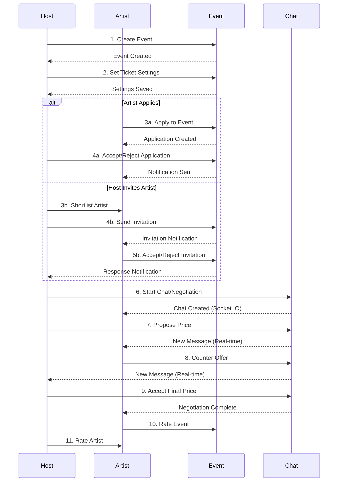
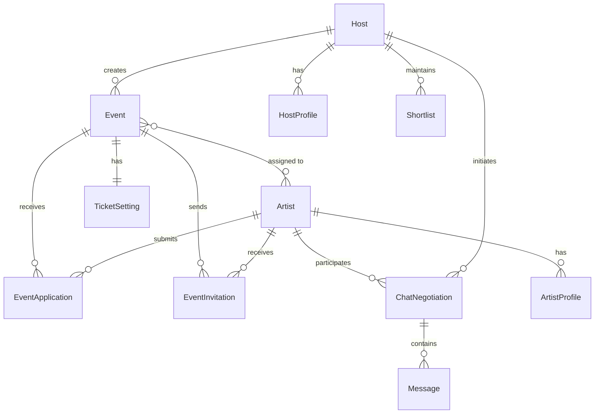

# SceneZone Application - Complete Data Flow Diagram

## System Overview
SceneZone is a platform connecting Artists and Hosts for event management and bookings. (User/attendee role has been removed.)

## Complete Data Flow Diagram

```mermaid
graph TB
    %% ========== AUTHENTICATION FLOW ==========
    subgraph Auth["🔐 Authentication Flow"]
        direction TB
        StartAuth[User Opens App] --> FirebaseOTP[Firebase OTP Verification]
        FirebaseOTP --> VerifyToken{Verify ID Token}
        VerifyToken -->|Valid| CheckUserType{User Type?}
        VerifyToken -->|Invalid| AuthError[Authentication Error]
        
        CheckUserType -->|Artist| ArtistSignup[Artist Signup]
        CheckUserType -->|Host| HostSignup[Host Signup]
        
        ArtistSignup --> CreateArtistDB[(Create Artist in MongoDB)]
        HostSignup --> CreateHostDB[(Create Host in MongoDB)]
        
        CreateArtistDB --> GenerateJWT[Generate JWT Token]
        CreateHostDB --> GenerateJWT
        
        GenerateJWT --> AuthSuccess[Authentication Success]
        AuthSuccess --> StoreToken[Store Token in Client]
        
        %% Login Flow
        Login[Login Request] --> LoginType{Login Type?}
        LoginType -->|Password| PasswordAuth[Password Authentication]
        LoginType -->|OTP| OTPAuth[OTP Authentication]
        PasswordAuth --> VerifyPassword[Verify Password with BCrypt]
        OTPAuth --> VerifyFirebaseOTP[Verify Firebase OTP]
        VerifyPassword --> GenerateJWT
        VerifyFirebaseOTP --> GenerateJWT
    end

    %% ========== PROFILE MANAGEMENT FLOW ==========
    subgraph Profile["👤 Profile Management Flow"]
        direction TB
        ProfileReq[Profile Request] --> AuthCheck1{Authenticated?}
        AuthCheck1 -->|No| ProfileAuthError[Unauthorized]
        AuthCheck1 -->|Yes| GetUserType{User Type?}
        
        GetUserType -->|Artist| ArtistProfileFlow[Artist Profile Flow]
        GetUserType -->|Host| HostProfileFlow[Host Profile Flow]
        
        ArtistProfileFlow --> ArtistProfileOps{Operation?}
        ArtistProfileOps -->|Create| CreateArtistProfile[Create Artist Profile]
        ArtistProfileOps -->|Update| UpdateArtistProfile[Update Artist Profile]
        ArtistProfileOps -->|Get| GetArtistProfile[Get Artist Profile]
        
        CreateArtistProfile --> UploadArtistImage[Upload Image to S3]
        UpdateArtistProfile --> UploadArtistImage
        UploadArtistImage --> SaveArtistProfile[(Save to ArtistProfile Collection)]
        
        HostProfileFlow --> HostProfileOps{Operation?}
        HostProfileOps -->|Create| CreateHostProfile[Create Host Profile]
        HostProfileOps -->|Update| UpdateHostProfile[Update Host Profile]
        HostProfileOps -->|Get| GetHostProfile[Get Host Profile]
        
        CreateHostProfile --> UploadHostImage[Upload Image to S3]
        UpdateHostProfile --> UploadHostImage
        UploadHostImage --> SaveHostProfile[(Save to HostProfile Collection)]
        
        SaveArtistProfile --> ProfileSuccess[Profile Operation Success]
        SaveHostProfile --> ProfileSuccess
    end

    %% ========== EVENT MANAGEMENT FLOW ==========
    subgraph Events["🎪 Event Management Flow"]
        direction TB
        EventReq[Event Request] --> AuthCheck2{Authenticated as Host?}
        AuthCheck2 -->|No| EventAuthError[Unauthorized]
        AuthCheck2 -->|Yes| EventOperation{Operation?}
        
        EventOperation -->|Create| CreateEvent[Create Event]
        EventOperation -->|Update| UpdateEvent[Update Event]
        EventOperation -->|Get| GetEvent[Get Event]
        EventOperation -->|Delete| DeleteEvent[Delete Event]
        
        CreateEvent --> ValidateEventData[Validate Event Data]
        ValidateEventData --> UploadPoster[Upload Event Poster to S3]
        UploadPoster --> SaveEvent[(Save to Event Collection)]
        SaveEvent --> SetTicketSettings[Set Default Ticket Settings]
        SetTicketSettings --> EventCreated[Event Created]
        
        UpdateEvent --> ValidateEventData
        GetEvent --> FetchEvent[(Fetch from Event Collection)]
        DeleteEvent --> DeleteFromDB[(Delete from Event Collection)]
        
        %% Ticket Settings
        TicketSettingsReq[Ticket Settings Request] --> UpdateTicketSettings[Update Ticket Settings]
        UpdateTicketSettings --> ValidateDates[Validate Sales Dates]
        ValidateDates --> ConvertDates[Convert ISO to Date Objects]
        ConvertDates --> SaveTicketSettings[(Save Ticket Settings to Event)]
        SaveTicketSettings --> TicketSettingsSuccess[Ticket Settings Updated]
    end

    %% ========== ARTIST APPLICATION & INVITATION FLOW ==========
    subgraph ArtistFlow["🎨 Artist Application & Invitation Flow"]
        direction TB
        %% Artist Application Flow
        ArtistAppReq[Artist Application Request] --> AuthCheck3{Authenticated as Artist?}
        AuthCheck3 -->|No| AppAuthError[Unauthorized]
        AuthCheck3 -->|Yes| CheckExistingApp{Application Exists?}
        CheckExistingApp -->|Yes| AppExistsError[Application Already Exists]
        CheckExistingApp -->|No| CreateApplication[Create EventApplication]
        CreateApplication --> SaveApplication[(Save to EventApplication Collection)]
        SaveApplication --> AppCreated[Application Created]
        
        %% Host Response to Application
        HostResponseReq[Host Response Request] --> AuthCheck4{Authenticated as Host?}
        AuthCheck4 -->|No| ResponseAuthError[Unauthorized]
        AuthCheck4 -->|Yes| UpdateAppStatus[Update Application Status]
        UpdateAppStatus --> AppStatus{Status?}
        AppStatus -->|Accepted| AddToAssigned[Add Artist to assignedArtists]
        AppStatus -->|Rejected| RemoveFromAssigned[Remove Artist from assignedArtists]
        AddToAssigned --> UpdateEvent[(Update Event Collection)]
        RemoveFromAssigned --> UpdateEvent
        UpdateEvent --> AppStatusUpdated[Application Status Updated]
        
        %% Host Invitation Flow
        HostInviteReq[Host Invitation Request] --> AuthCheck5{Authenticated as Host?}
        AuthCheck5 -->|No| InviteAuthError[Unauthorized]
        AuthCheck5 -->|Yes| CheckShortlist{Artist Shortlisted?}
        CheckShortlist -->|No| NotShortlistedError[Artist Not Shortlisted]
        CheckShortlist -->|Yes| CheckExistingInvite{Invitation Exists?}
        CheckExistingInvite -->|Yes| InviteExistsError[Invitation Already Sent]
        CheckExistingInvite -->|No| CreateInvitation[Create EventInvitation]
        CreateInvitation --> SaveInvitation[(Save to EventInvitation Collection)]
        SaveInvitation --> SendNotification[Send Notification to Artist]
        SendNotification --> InviteCreated[Invitation Created]
        
        %% Artist Response to Invitation
        ArtistResponseReq[Artist Response Request] --> AuthCheck6{Authenticated as Artist?}
        AuthCheck6 -->|No| ArtistResponseAuthError[Unauthorized]
        AuthCheck6 -->|Yes| FindInvitation[Find EventInvitation]
        FindInvitation --> InviteStatus{Invitation Status?}
        InviteStatus -->|Not Pending| InvalidInviteError[No Pending Invitation]
        InviteStatus -->|Pending| UpdateInviteStatus[Update Invitation Status]
        UpdateInviteStatus --> ResponseType{Response?}
        ResponseType -->|Accepted| AddArtistToEvent[Add Artist to Event]
        ResponseType -->|Rejected| RejectInvite[Mark as Rejected]
        AddArtistToEvent --> UpdateEvent2[(Update Event Collection)]
        RejectInvite --> UpdateInvitation[(Update EventInvitation Collection)]
        UpdateEvent2 --> InviteResponded[Invitation Responded]
        UpdateInvitation --> InviteResponded
    end

    %% ========== CHAT & NEGOTIATION FLOW ==========
    subgraph Chat["💬 Chat & Negotiation Flow"]
        direction TB
        %% Start Chat
        StartChatReq[Start Chat Request] --> AuthCheck7{Authenticated as Host?}
        AuthCheck7 -->|No| ChatAuthError[Unauthorized]
        AuthCheck7 -->|Yes| ValidateChatData[Validate Event & Artist IDs]
        ValidateChatData --> CheckExistingChat{Chat Exists?}
        CheckExistingChat -->|Yes| ChatExistsError[Chat Already Exists]
        CheckExistingChat -->|No| CreateChat[Create ChatNegotiation]
        CreateChat --> SaveChat[(Save to ChatNegotiation Collection)]
        SaveChat --> EmitNewChat[Emit 'newChat' via Socket.IO]
        EmitNewChat --> NotifyArtist[Send Notification to Artist]
        NotifyArtist --> ChatCreated[Chat Created]
        
        %% Send Message
        SendMsgReq[Send Message Request] --> AuthCheck8{Authenticated?}
        AuthCheck8 -->|No| MsgAuthError[Unauthorized]
        AuthCheck8 -->|Yes| ValidatePrice[Validate Proposed Price]
        ValidatePrice --> FindChat[Find ChatNegotiation]
        FindChat --> CheckChatAccess{User Authorized?}
        CheckChatAccess -->|No| ChatAccessError[Unauthorized Access]
        CheckChatAccess -->|Yes| CheckNegotiationComplete{Negotiation Complete?}
        CheckNegotiationComplete -->|Yes| NegotiationCompleteError[Negotiation Already Complete]
        CheckNegotiationComplete -->|No| CreateMessage[Create Message Object]
        CreateMessage --> AddMessageToChat[Add Message to Chat]
        AddMessageToChat --> UpdateChatPrice[Update Latest Proposed Price]
        UpdateChatPrice --> SaveChatMsg[(Save ChatNegotiation)]
        SaveChatMsg --> EmitNewMessage[Emit 'newMessage' via Socket.IO]
        EmitNewMessage --> NotifyRecipient[Send Notification to Recipient]
        NotifyRecipient --> MessageSent[Message Sent]
        
        %% Get Chat History
        GetChatReq[Get Chat History Request] --> AuthCheck9{Authenticated?}
        AuthCheck9 -->|No| GetChatAuthError[Unauthorized]
        AuthCheck9 -->|Yes| FetchChatHistory[(Fetch ChatNegotiation)]
        FetchChatHistory --> PopulateChat[Populate Artist & Host Data]
        PopulateChat --> ReturnChatHistory[Return Chat History]
        
        %% Socket.IO Connection
        SocketConnect[Socket.IO Connection] --> JoinRoom[Join Room by User ID]
        JoinRoom --> ListenMessages[Listen for Messages]
        ListenMessages --> ReceiveMessage[Receive Real-time Message]
    end

    %% ========== NOTIFICATION FLOW ==========
    subgraph Notifications["🔔 Notification Flow"]
        direction TB
        NotificationEvent[Notification Event Triggered] --> CreateNotification[Create Notification]
        CreateNotification --> GetFCMToken[(Get FCM Token)]
        GetFCMToken --> SendPushNotification[Send Push Notification via FCM]
        SendPushNotification --> SaveNotification[(Save to Notification Collection)]
        SaveNotification --> NotificationSent[Notification Sent]
    end

    %% ========== DATABASE COLLECTIONS ==========
    subgraph Database["💾 Database Collections"]
        direction LR
        ArtistAuth[(ArtistAuthentication)]
        HostAuth[(HostAuthentication)]
        ArtistProfileDB[(ArtistProfile)]
        HostProfileDB[(HostProfile)]
        EventsDB[(Event)]
        EventApplicationDB[(EventApplication)]
        EventInvitationDB[(EventInvitation)]
        ChatNegotiationDB[(ChatNegotiation)]
        NotificationDB[(Notification)]
        BookingDB[(Booking)]
        InvoiceDB[(Invoice)]
    end

    %% ========== EXTERNAL SERVICES ==========
    subgraph External["🌐 External Services"]
        direction TB
        Firebase[Firebase Authentication]
        S3[AWS S3 Storage]
        Razorpay[Razorpay Payment Gateway]
        FCM[Firebase Cloud Messaging]
        SocketIO[Socket.IO Server]
    end

    %% ========== CONNECTIONS ==========
    Auth --> Profile
    Auth --> Events
    Auth --> ArtistFlow
    Auth --> Chat
    Auth --> TicketBooking
    
    Profile --> Database
    Events --> Database
    ArtistFlow --> Database
    Chat --> Database
    TicketBooking --> Database
    Notifications --> Database
    
    Auth --> Firebase
    Profile --> S3
    Events --> S3
    TicketBooking --> Razorpay
    Notifications --> FCM
    Chat --> SocketIO
    
    %% Styling
    classDef authClass fill:#e1f5ff,stroke:#01579b,stroke-width:2px
    classDef profileClass fill:#f3e5f5,stroke:#4a148c,stroke-width:2px
    classDef eventClass fill:#fff3e0,stroke:#e65100,stroke-width:2px
    classDef chatClass fill:#e8f5e9,stroke:#1b5e20,stroke-width:2px
    classDef ticketClass fill:#fce4ec,stroke:#880e4f,stroke-width:2px
    classDef dbClass fill:#fff9c4,stroke:#f57f17,stroke-width:2px
    classDef extClass fill:#e0f2f1,stroke:#004d40,stroke-width:2px
    
    class StartAuth,FirebaseOTP,VerifyToken,ArtistSignup,HostSignup,Login,GenerateJWT authClass
    class ProfileReq,ArtistProfileFlow,HostProfileFlow profileClass
    class EventReq,CreateEvent,UpdateEvent,GetEvent,TicketSettingsReq eventClass
    class StartChatReq,SendMsgReq,GetChatReq,SocketConnect chatClass
    class ArtistAuth,HostAuth,EventsDB,ChatNegotiationDB dbClass
    class Firebase,S3,Razorpay,FCM,SocketIO extClass
```

## Key Data Flows Summary

### 1. **Authentication Flow**
- Artists and Hosts authenticate via Firebase OTP
- JWT tokens are generated and stored client-side
- Role-based access control via `authMiddleware`

### 2. **Profile Management**
- Separate profile collections for Artist and Host
- Profile images stored in AWS S3
- Profile completion status tracked in auth models

### 3. **Event Management**
- Hosts create events with ticket settings
- Events stored with poster images in S3
- Ticket settings include sales dates, prices, quantities

### 4. **Artist Application & Invitation**
- Artists can apply to events → Creates `EventApplication`
- Hosts can invite shortlisted artists → Creates `EventInvitation`
- Both flows update `assignedArtists` array in Event model

### 5. **Chat & Negotiation**
- Hosts initiate chats with artists for price negotiation
- Real-time messaging via Socket.IO
- Messages stored in `ChatNegotiation` collection
- Notifications sent on new messages

### 6. **Notifications**
- FCM tokens stored per user
- Notifications sent for: invitations, messages, bookings, etc.
- Notification history stored in database

## Technology Stack
- **Backend**: Node.js, Express.js
- **Database**: MongoDB with Mongoose
- **Authentication**: Firebase Auth + JWT
- **Storage**: AWS S3
- **Payments**: Razorpay
- **Real-time**: Socket.IO
- **Push Notifications**: Firebase Cloud Messaging

---

## Simplified User Journey Diagram

This diagram shows the main interactions between different user types:

## Key User Interactions

### Host Journey
1. **Sign Up/Login** → Create Profile → Create Event
2. **Shortlist Artists** → Send Invitations OR Review Applications
3. **Start Chat** → Negotiate Price → Finalize Booking
4. **Set Ticket Settings** → Publish Event → Manage Bookings
5. **Rate Artists** after event completion

### Artist Journey
1. **Sign Up/Login** → Create Profile → Upload Performance Gallery
2. **Browse Events** → Apply to Events OR Receive Invitations
3. **Respond to Invitations** → Accept/Reject
4. **Chat with Host** → Negotiate Price → Accept/Reject Final Offer
5. **Get Assigned** → Perform at Event → Rate Event

## Data Relationships

## API Endpoint Summary

### Authentication (Artist & Host only)
- `POST /api/artist/auth/signup` - Artist sign up with Firebase OTP
- `POST /api/artist/auth/login` - Artist login
- `POST /api/host/auth/signup` - Host sign up with Firebase OTP
- `POST /api/host/auth/login` - Host login
- `POST /api/{userType}/auth/forgot-password` - Password reset

### Profile (Artist & Host only)
- `POST /api/artist/profile` - Create/update artist profile
- `GET /api/artist/profile` - Get artist profile
- `POST /api/host/profile` - Create/update host profile
- `GET /api/host/profile` - Get host profile

### Events (Host)
- `POST /api/host/events` - Create event
- `PUT /api/host/events/:id` - Update event
- `GET /api/host/events/:id` - Get event
- `PUT /api/host/:eventId/ticket-settings` - Update ticket settings

### Artist Applications
- `POST /api/artist/event-application` - Apply to event
- `GET /api/artist/event-application` - Get applications
- `PUT /api/host/event-application/:id` - Host responds to application

### Invitations
- `POST /api/host/invitation` - Send invitation
- `PUT /api/artist/respond-invite` - Artist responds to invitation

### Chat
- `POST /api/chat/start` - Start chat (Host only)
- `POST /api/chat/:chatId/message` - Send message
- `GET /api/chat/:chatId` - Get chat history
- `GET /api/chat` - Get all chats

### Notifications
- `GET /api/notifications` - Get notifications
- `PUT /api/notifications/:id/read` - Mark as read

